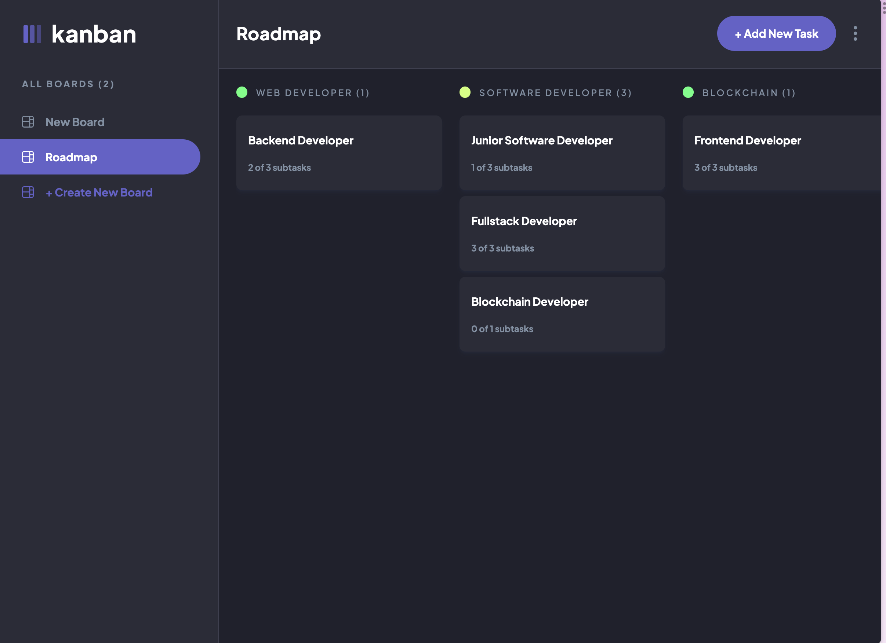

# Kanban task management web app

A Kanban task management web application with a drag-and-drop functionality, and a real-time database integration with MongoDB.

### Features

Users should be able to:

- View the optimal layout for the app depending on their device's screen size
- See hover states for all interactive elements on the page
- Create, read, update, and delete boards and tasks
- Receive form validations when trying to create/edit boards and tasks
- Mark subtasks as complete and move tasks between columns
- Allow users to drag and drop tasks to change their status and re-order them in a column
- Keep track of any changes, even after refreshing the browser

### Links

- Solution URL: [Github](https://github.com/sqle157/kanban-task-management)
- Live Site URL: [Render](https://kanban-task-management-webapp.onrender.com/)

### Built with

- Semantic HTML5 markup
- CSS custom properties
- Flexbox
- CSS Grid
- Mobile-first workflow
- Node - Backend
- Express - Backend
- MongoDB - Backend
- [Typescript](https://www.typescriptlang.org/)
- [React](https://reactjs.org/) - JS library
- [Tailwind CSS](https://tailwindcss.com/) - For styles

### Useful resources

- [Typescript](https://www.typescriptlang.org/) - This is where I learned about Typescript concepts, and it really helped me a lot.
- [Typescript and React](https://react-typescript-cheatsheet.netlify.app/) - This is a website containing cheatsheet for React Typescript, and it's where I learned how to write React code in Typescript.
- [DeviousLab's Kanban solution](https://github.com/DeviousLab/mern-kanban-board) - This is a MERN solution for Kanban Board that I found on Github owned by DeviousLab. It really gave me a lot of idea on how to write a Kanban Board MERN App.

## Author

- Github - [Sang Le](https://github.com/sqle157)
- Website - [Sang Le](https://www.sanglq.com/)
